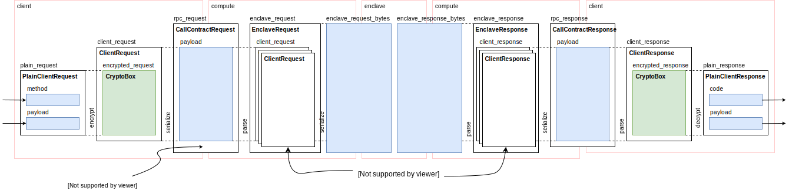

# RPC types
Making a call to a contract moves the method name, arguments, response code, and return value through several messages between the client, compute node, and contract enclave.
See the diagram below for a summary of these types.

